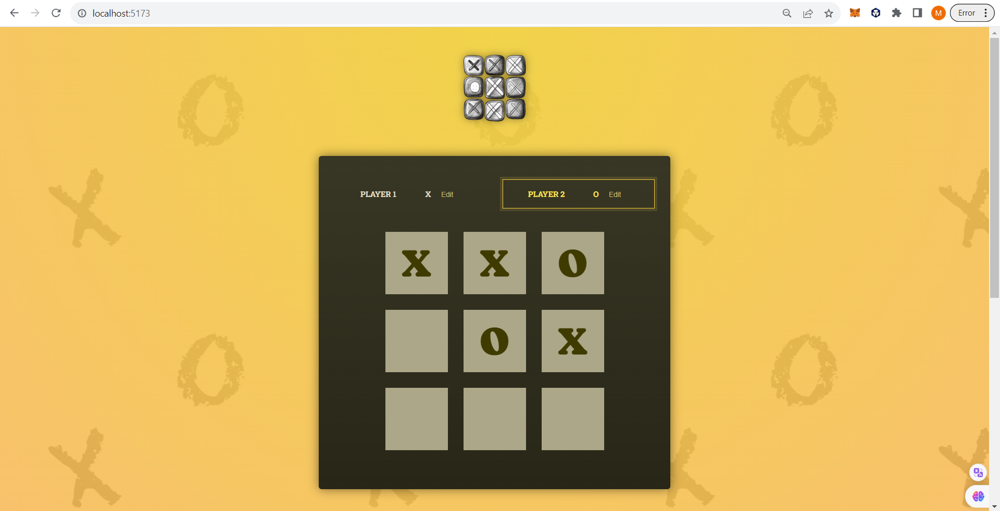

# Tic-Tac-Toe-using-React

A simple demonstration of Tic-Tac-Toe game using React.

To run the project on your local machine:
1) Clone the repository
2) Run npm install on your terminal
3) Run npm run dev on your terminal

  

